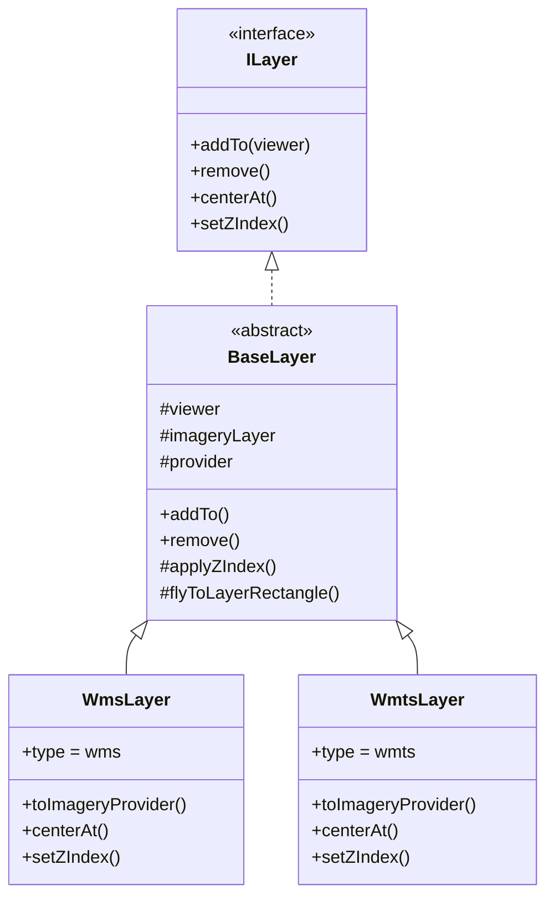

# 架构说明

## 设计目标

wiselayer 在 Cesium 原生 Provider 之上提供一层**统一的图层抽象**，让 WMS 和 WMTS 可以用相同的方式创建、管理和交互，而不重复实现 OGC 协议细节。

```
用户配置 (LayerOptions)
        │
        ▼
   createLayer()  ──►  WmsLayer / WmtsLayer
        │                    │
        │                    ▼
        │           toImageryProvider()
        │                    │
        ▼                    ▼
      addTo(viewer) ──► Cesium ImageryLayer
```

## 目录结构

```
src/
├── index.ts              # 公共 API 出口
├── types/                  # TypeScript 类型定义
│   ├── base.ts             # 公共配置、CenterAtOptions
│   ├── wms.ts              # WMS 专属配置
│   ├── wmts.ts             # WMTS 专属配置
│   └── index.ts            # 类型联合导出
├── layers/                 # 图层实现
│   ├── BaseLayer.ts        # 抽象基类（生命周期、显隐、层级）
│   ├── WmsLayer.ts         # WMS 实现
│   └── WmtsLayer.ts        # WMTS 实现
├── factory/
│   └── createLayer.ts      # 工厂方法、批量添加
└── utils/                  # 工具函数
    ├── crs.ts              # WMS crs/srs 版本适配
    ├── url.ts              # URL 参数合并
    ├── camera.ts           # 相机定位
    └── imageryLayerOrder.ts # 图层层级排序
```

## 核心类关系



## 数据流：addTo

1. 调用 `remove()` 清理旧实例（若存在）
2. 保存 `viewer` 引用
3. 调用子类 `toImageryProvider()` 创建 Provider
4. 通过 `viewer.imageryLayers.addImageryProvider()` 加入场景
5. 若配置了 `zIndex`，调用 `setZIndex()` 调整顺序

## 数据流：centerAt

1. 子类调用 `getProviderRectangle(options.rectangle)`
2. 优先返回用户配置的 `rectangle`，否则读取 Provider 的范围
3. 若范围为 `Rectangle.MAX_VALUE`（全球），抛出错误
4. 调用 `viewer.camera.flyTo({ destination: rectangle })`

## 数据流：setZIndex

1. 获取当前 ImageryLayer 在 `imageryLayers` 中的 index
2. 将目标 zIndex clamp 到 `[0, length - 1]`
3. 循环调用 Cesium 的 `raise()` / `lower()` 移动到目标位置

## 与 Cesium 的边界

| 职责 | wiselayer | Cesium |
|------|-----------|--------|
| OGC 协议请求 | 委托 Provider | WebMapServiceImageryProvider 等 |
| 瓦片加载渲染 | - | ImageryLayer |
| 图层抽象 API | createLayer、ILayer | - |
| 相机控制 | centerAt 封装 | camera.flyTo |
| 层级管理 | setZIndex 封装 | imageryLayers.raise/lower |

## 依赖关系

- **peerDependency**: `cesium` — 由使用方安装，不打包进库
- **构建**: tsup — 输出 ESM + CJS + `.d.ts`
- **测试**: Vitest — 单元测试，mock Cesium 集合

## 扩展方向

未来可扩展的图层类型（需新增子类并在 factory 中注册）：

- XYZ / TMS 瓦片
- WFS 矢量（不同渲染管线）
- GetCapabilities 自动发现图层

当前版本聚焦 WMS / WMTS 影像图层，保持 API 简洁。
